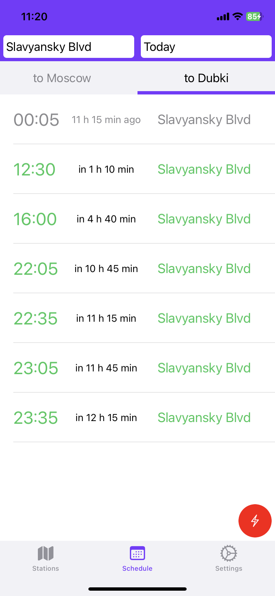
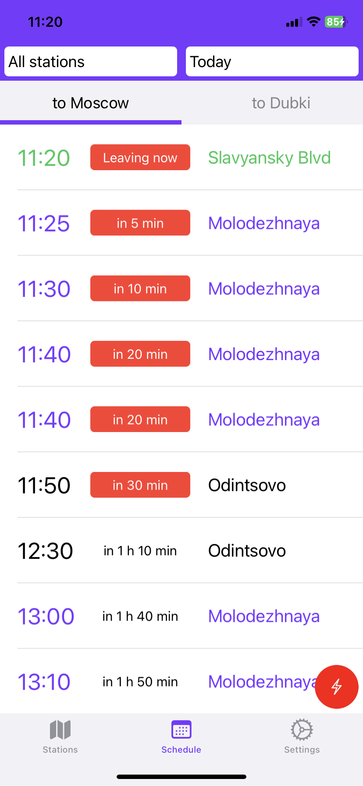

## Dubovozki IOS app: 
#### The application provides a free bus schedule and list of stations for the Dubki dormitory in the form of list. 
❗App Store: https://apps.apple.com/tr/app/dubovozki/id6475046573
##### User able to see upcoming buses for the current day and see the schedule for each day of the week and direction.
This application implements:
* UIKit 
* Login via Email/Password and Google
* Architecture patterns: MVC, MVP, VIPER
* Persistence: Core data, User defaults, Key chain
* Vapor server for this app: https://github.com/ProbablyDead/DubovozkiServer.git
* Several products: for Firebase and server backend
* SOLID
* Localization for Russian and English
* Change application appearance Light/Dark

---

## Visual

### *Login:*

    

### *Schedule:*

List|Sort list|Sorted list
|-|-|-|
| | 

### *Appearance:*
Light|Dark|Russian
|-|-|-|
| | 

### *Stations:*
List|Additional
|-|-|
| 

### *Settings:* 

    

